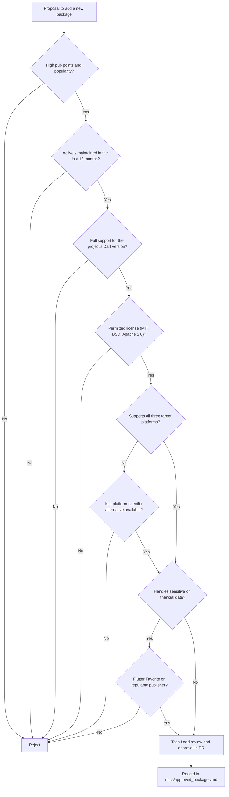
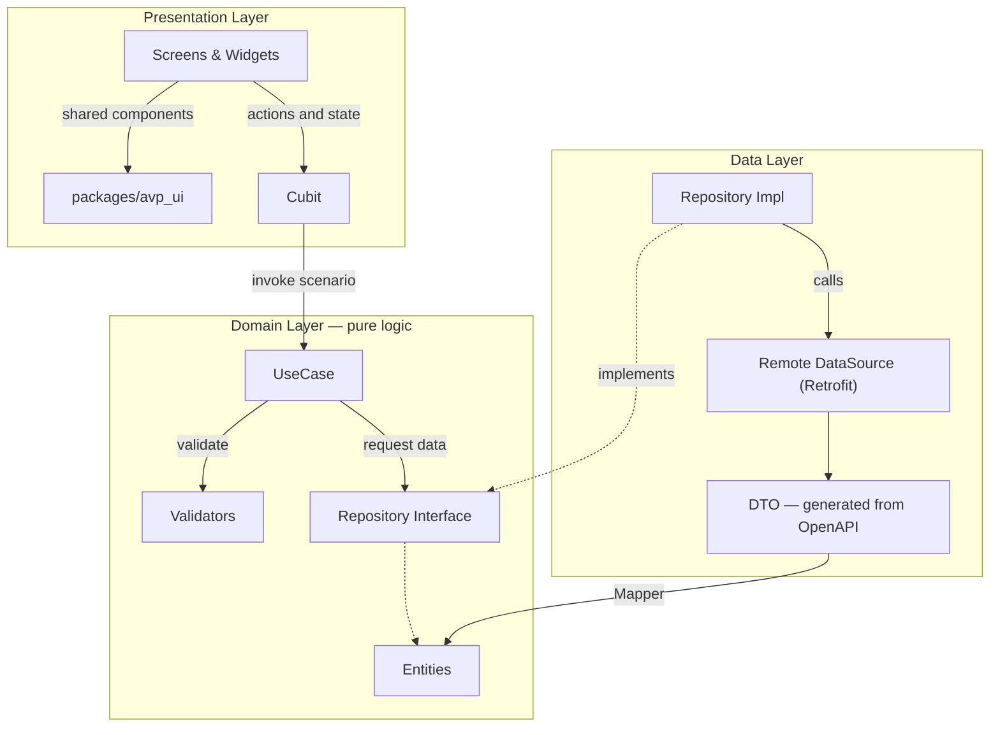
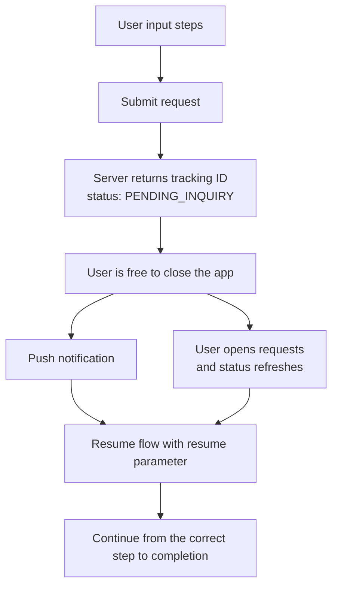
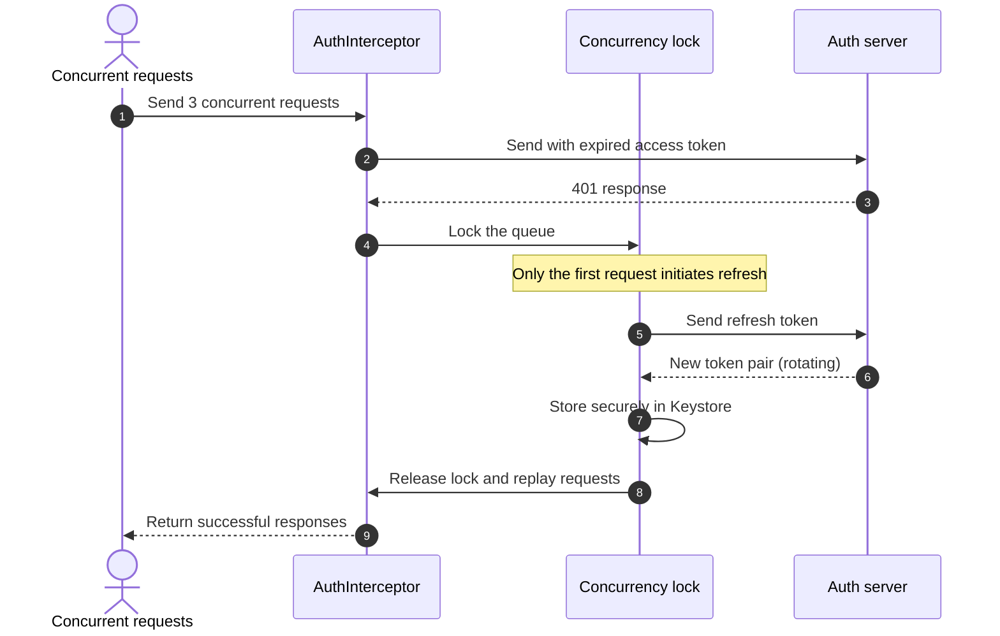
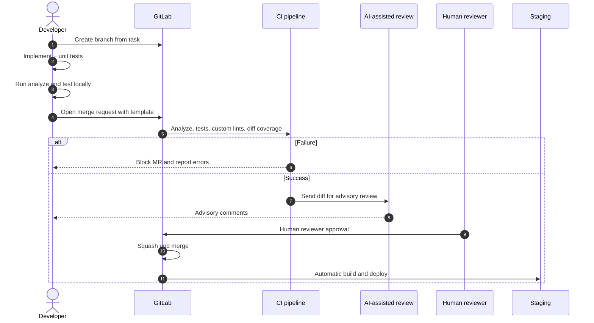

# Architecture Document — Smart Virtual Counter Mobile Application

**Project:** Multi-platform mobile application for the Smart Virtual Counter — Resalat Qarz-al-Hasaneh Bank
**Contractor:** Avat Vira Pardaz Co.
**Framework:** Flutter (Dart 3+)
**Domain:** Request-based banking services (80+ services) with an AI conversational assistant
**Document version:** 2.0.0
**Status:** Revised draft — ready for final review and development kickoff

---

## Table of Contents

1. [Architectural Goals and Principles](#1-architectural-goals-and-principles)
2. [Product Scope and Target Platforms](#2-product-scope-and-target-platforms)
3. [Technology Stack](#3-technology-stack)
4. [Development Environment and Versions](#4-development-environment-and-versions)
5. [Third-Party Dependency Governance](#5-third-party-dependency-governance)
6. [Project Structure and Modularization](#6-project-structure-and-modularization)
7. [Layering Pattern](#7-layering-pattern-clean-architecture)
8. [Service Flow Pattern and Suspended Requests](#8-service-flow-pattern-and-suspended-requests)
9. [Security and Compliance Layer](#9-security-and-compliance-layer)
10. [Network and Authentication Layer](#10-network-and-authentication-layer)
11. [Error Handling Pattern](#11-error-handling-pattern-result--failure)
12. [State Management with Cubit](#12-state-management-with-cubit)
13. [Design System Package](#13-design-system-package-avp_ui)
14. [Localization, Persian Support, and Dates](#14-localization-persian-support-and-dates)
15. [Routing and Guards](#15-routing-and-guards)
16. [Testing Strategy](#16-testing-strategy)
17. [Development and Code Review Process](#17-development-and-code-review-process)
18. [Environments, CI/CD, and Release](#18-environments-cicd-and-release)
19. [AI Assistant and Agent Layer](#19-ai-assistant-and-agent-layer)
20. [Open Items and Dependencies](#20-open-items-and-dependencies)
21. [Change Log](#21-change-log)

---

## 1. Architectural Goals and Principles

* **Separation of concerns and the Dependency Rule:** business logic (Domain) and validators have no dependency on the presentation layer or the framework.
* **Presentation separated from validation:** display formatters live in the `avp_ui` package; pure validators live in `core/validators`.
* **Independent design system:** visual components, theming, tokens, and shared widgets reside in the standalone `packages/avp_ui`.
* **Single source of truth for the data contract:** the bank's OpenAPI specification is the shared basis for both the app and the Agent layer, preventing divergence between the traditional form path and the conversational path.
* **Team scalability:** parallel development by multiple engineers without collisions, enforced by module boundaries at the lint level.
* **Platform-appropriate security:** one security policy with different implementations on Android, iOS, and Web, backed by an explicit capability matrix.
* **Configurable security decisions:** adjustable thresholds and policies (timeout, device risk, sensitive services) are externalized from code and served remotely.
* **Targeted testability:** full coverage of pure logic and mappers, without imposing unnecessary cost on the UI layer.

---

## 2. Product Scope and Target Platforms

### 2.1 Product Scope

The application covers **request-based services only**. Payment-oriented services (card-to-card, bill payment, fund transfer) are **out of scope** and remain in the bank's mobile and internet banking channels.

Users can obtain services through two paths:

1. **Traditional interface:** browsing the service catalog and completing multi-step forms.
2. **Conversational interface:** talking to the AI assistant via text or voice.

### 2.2 Target Platforms

| Platform | Role | Status |
|---|---|---|
| Android | Primary product | Distributed via domestic app stores and direct APK |
| iOS | Primary product | Final release path requires clarification (Section 20) |
| Web (Flutter Web) | Fallback for iOS users | Mobile Safari on iOS only |

**Role of the web build:** it targets mobile Safari on iOS and is activated if publishing the native iOS build is blocked. Desktop and Android browser support is out of scope.

### 2.3 Per-Platform Capability Matrix

| Capability | Android | iOS | Web |
|---|---|---|---|
| Secure token storage | Keystore | Keychain | Memory only (no refresh token) |
| SSL certificate pinning | ✅ | ✅ | ❌ (browser responsibility) |
| Screenshot prevention | FLAG_SECURE | Blur overlay | ❌ |
| Background privacy shield | ✅ | ✅ | Limited |
| Device security evaluation | ✅ Full | Limited | ❌ (always Trusted) |
| Obfuscation | ✅ | ✅ | Minification only |
| Biometric authentication | ✅ | ✅ | ❌ |
| Push notifications | Domestic provider | APNs | ❌ |
| Assistant voice input | ✅ | ✅ | Limited / disabled |
| Session timeout | ✅ | ✅ | ✅ |

> [!IMPORTANT]
> The web build inherently offers a lower assurance level. The list of sensitive services disabled on web is determined by the bank's security team and applied through server configuration. The architecture supports disabling any service on a per-platform basis.

---

## 3. Technology Stack

| Layer / Concern | Chosen Solution | Rationale |
|---|---|---|
| **State Management** | `flutter_bloc` (Cubit) | Minimal boilerplate, high testability, simple mental model |
| **Immutability** | Native Dart 3 `sealed class` + `freezed` (limited) | Reduced code generation; freezed reserved for form states |
| **UI Package** | `packages/avp_ui` (local package) | Independent design system: tokens, theme, widgets, formatters |
| **Pure Validators** | `app/lib/core/validators` | Pure validation (Luhn, IBAN, national ID) with no Flutter dependency |
| **Network Client** | `dio` + `retrofit` | Type-safe, advanced interceptors |
| **Serialization** | `json_serializable` | Generated from the bank's OpenAPI spec |
| **Dependency Injection** | `get_it` + `injectable` | Automatic registration, avoids Git conflicts on the DI file |
| **Routing & Deep Links** | `go_router` | Tree structure, central guard, web support |
| **Local Secure Storage** | `flutter_secure_storage` (mobile only) | Keystore / Keychain |
| **Error Handling** | `sealed class Result<T>` + `Equatable` | Exhaustive pattern matching and value equality in tests |
| **Localization** | `flutter_localizations` + ARB | Persian, with infrastructure for English and Arabic |
| **Dates** | Jalali calendar in the presentation layer | Domain always uses Gregorian/UTC |
| **Linting** | `very_good_analysis` + `custom_lint` | Architectural rules enforced at error level |
| **Testing** | `test`, `bloc_test`, `mocktail` | Mocking without code generation |

---

## 4. Development Environment and Versions

### 4.1 Version Selection Policy

At the time of writing, the stable Flutter release is **3.47.1** (released 19 August 2026, shipping with Dart 3.13.1).

Project policy: **one minor version behind the latest stable.** The newest release may carry undiscovered issues; one version back is typically settled and still supported.

> [!CAUTION]
> **Once selected, the version is not upgraded until the end of the project**, except for a critical security vulnerability or a blocking bug with no workaround. Upgrading Flutter mid-development across 80 forms requires a full visual regression review of the application.

### 4.2 Version Table

| Parameter | Value | Applied In |
|---|---|---|
| **Flutter SDK** | `[one version behind stable — to be finalized by Tech Lead]` | `.fvmrc` and `pubspec.yaml` |
| **Dart SDK** | Matching the selected Flutter version | `pubspec.yaml` |
| **FVM** | Latest stable | Mandatory team tool |
| **Android minSdkVersion** | `[26]` — proposed | Access to Keystore security capabilities |
| **Android targetSdk / compileSdk** | Per the current Google Play requirement at release time | `android/build.gradle` |
| **iOS Deployment Target** | Per the minimum required by the selected Flutter version | `ios/Podfile` |
| **JDK** | Per the AGP requirement of the selected version | Build environment |

> [!NOTE]
> Native version numbers must be taken from the official documentation of the selected Flutter release, not from this table. Google Play requirements change annually and must be re-checked at release time.

### 4.3 FVM Standard

All developers must run Flutter through `fvm`:

```json
// .fvmrc
{
  "flutter": "<exact selected version>"
}
```

The exact Flutter version must also be recorded in `pubspec.yaml` so CI can read it from a single source of truth:

```yaml
environment:
  sdk: <Dart constraint>
  flutter: <exact version>
```

Standard commands: `fvm install` / `fvm flutter run` / `fvm dart run build_runner build`

**No individual upgrades:** no developer may change the SDK or Gradle version in a feature branch.

---

## 5. Third-Party Dependency Governance

### 5.1 Package Acceptance Criteria



### 5.2 Checklist

1. **Quality and popularity:** at least `[130 of 140]` pub points and popularity above `[85%]`.
2. **Active maintenance:** a release or bug fix within the `[last 12 months]`.
3. **License:** **MIT**, **BSD-3-Clause**, or **Apache 2.0** only.
4. **Platform support:** the package must cover all three target platforms or have a clearly defined platform-specific alternative. A package that fails to compile on web breaks the entire web build.
5. **Security-related packages:** anything touching cryptography, biometrics, storage, or transactional data must carry the **Flutter Favorite** badge or come from a reputable publisher.

> [!CAUTION]
> Copyleft-licensed packages (GPL, AGPL, LGPL) are **prohibited** due to legal risk in banking software.

### 5.3 Approval Process

1. In the PR description, the developer states why an in-house implementation is not viable and names two evaluated alternatives with reasons for rejection.
2. Merging depends on **Tech Lead** approval.
3. Once approved, the package is added to `docs/approved_packages.md`.

---

## 6. Project Structure and Modularization

### 6.1 Granularity Principle: Feature = Service Category

With 80+ services, creating a three-layer module per service would produce 80 folders and 240 sub-layers, making maintenance cost, code generation volume, and DI complexity unmanageable.

**Decision:** the unit of modularization is the **service category**, not the individual service. Related services share entities and repositories; each service has its own use case and its own presentation flow.

### 6.2 Module List

| Module | Scope |
|---|---|
| `auth` | Login, OTP, password, biometrics, password change |
| `shell` | Home screens, navigation, service catalog and search, onboarding |
| `cards` | Card services |
| `deposits` | Deposit and account services |
| `loans` | Facility services |
| `cheque` | Cheque services |
| `modern_banking` | Modern banking services |
| `wallet` | Digital wallet |
| `identity` | Identity information and verification |
| `profile` | Profile, settings, message center |
| `requests` | Request tracking, history, and resumption |
| `assistant` | AI assistant chat and voice |

**Inquiries** do not form a standalone module; they are implemented as a cross-cutting capability inside the relevant module.

**`requests` is deliberately independent:** once submitted, a request no longer belongs to its category, and users view all requests in a single list. Embedding this inside each module would produce eleven different tracking implementations.

### 6.3 Decision: Folders Instead of Packages

Modules are implemented as **folders** under `app/lib/features/`, not as standalone packages with `melos`. Rationale: lower setup complexity and learning curve for a four-person team.

Three safeguards this decision removes, which must be compensated for:

1. **Import boundaries:** enforced by a `custom_lint` rule (Section 17.4).
2. **Git conflict hotspots:** resolved by distributing routes and constants into modules and by automatic DI registration.
3. **Code generation speed:** addressed by narrowing generator scope and limiting `freezed` usage (Section 12.3).

### 6.4 Directory Tree

```text
pishkhan_project/
│
├── packages/
│   └── avp_ui/                          # Standalone design system package
│       ├── pubspec.yaml                 # flutter, flutter_svg only
│       └── lib/
│           ├── avp_ui.dart              # Single barrel
│           ├── tokens/                  # Color, typography, spacing, radius, shadow
│           ├── theme/                   # app_theme.dart (light theme only)
│           ├── widgets/
│           │   ├── buttons/
│           │   ├── fields/              # Banking-specific fields
│           │   ├── selectors/           # Card, deposit, Jalali date pickers
│           │   ├── layout/              # Form step shell, AsyncStateBuilder
│           │   ├── feedback/            # Dialogs, bottom sheets, security banner
│           │   ├── loaders/
│           │   └── directional_icon.dart
│           ├── input/
│           │   └── digit_normalizer.dart   # TextInputFormatter for Persian/Arabic digits
│           ├── formatters/
│           │   ├── currency_formatter.dart
│           │   ├── card_display_formatter.dart
│           │   ├── iban_display_formatter.dart
│           │   └── jalali_date_formatter.dart
│           └── extensions/
│               └── context_extensions.dart
│
└── app/
    ├── pubspec.yaml                     # avp_ui: { path: ../packages/avp_ui }
    └── lib/
        ├── main_development.dart
        ├── main_staging.dart
        ├── main_production.dart
        ├── app.dart
        │
        ├── core/                        # App infrastructure, no UI dependency
        │   ├── di/
        │   ├── network/
        │   │   ├── dio_factory.dart
        │   │   ├── ssl_pinning.dart
        │   │   ├── token_store.dart          # Interface + mobile/web implementations
        │   │   └── interceptors/
        │   │       ├── correlation_id_interceptor.dart
        │   │       ├── locale_interceptor.dart
        │   │       ├── idempotency_interceptor.dart
        │   │       ├── auth_interceptor.dart
        │   │       ├── security_interceptor.dart
        │   │       ├── error_mapping_interceptor.dart
        │   │       └── logging_interceptor.dart
        │   ├── security/
        │   │   ├── platform_security.dart    # Interface + three implementations
        │   │   ├── security_verdict.dart
        │   │   ├── security_service.dart     # Evaluation and result caching
        │   │   ├── screen_protector.dart
        │   │   ├── secure_storage.dart
        │   │   ├── session_manager.dart
        │   │   └── activity_tracker.dart
        │   ├── validators/
        │   │   ├── validators.dart
        │   │   ├── card_validator.dart
        │   │   ├── iban_validator.dart
        │   │   └── national_code_validator.dart
        │   ├── result/
        │   │   ├── result.dart
        │   │   ├── result_extensions.dart
        │   │   └── failure.dart
        │   ├── flow/
        │   │   ├── service_flow.dart          # Flow entry/exit contract
        │   │   ├── flow_outcome.dart
        │   │   └── service_registry.dart      # serviceId → route mapping
        │   ├── config/
        │   │   └── remote_config.dart         # Timeout, thresholds, enabled services
        │   ├── push/
        │   │   └── push_service.dart          # Interface + platform implementations
        │   ├── cubit/
        │   │   └── base_cubit.dart
        │   └── router/
        │       ├── app_router.dart
        │       └── guards/
        │           ├── security_guard.dart
        │           ├── update_guard.dart
        │           ├── auth_guard.dart
        │           └── platform_guard.dart
        │
        ├── l10n/                        # ARB files
        │
        └── features/
            ├── cards/
            │   ├── domain/
            │   │   ├── entities/
            │   │   ├── repositories/
            │   │   └── usecases/
            │   ├── data/
            │   │   ├── datasources/
            │   │   ├── models/
            │   │   │   ├── generated/   # Generated from OpenAPI — never edit manually
            │   │   │   └── ...
            │   │   ├── mappers/
            │   │   └── repositories/
            │   ├── presentation/
            │   │   ├── flows/           # One sub-folder per service
            │   │   │   └── block_card/
            │   │   │       ├── cubit/
            │   │   │       ├── screens/
            │   │   │       └── widgets/
            │   │   └── shared/          # Widgets shared within this category
            │   └── cards_routes.dart    # Route constants + route definitions
            │
            ├── loans/
            ├── deposits/
            ├── cheque/
            ├── requests/
            ├── assistant/
            └── ...
```

---

## 7. Layering Pattern (Clean Architecture)

Each module consists of three strictly bounded layers:



### 7.1 Hard Layering Rules

| Rule | Enforcement |
|---|---|
| Domain imports nothing from Flutter or the UI package | `custom_lint` |
| DTOs never enter the Domain layer; conversion only in `mappers/` | Review + folder structure |
| `dio` and `DioException` are prohibited outside `data/` | `custom_lint` |
| No feature module imports another feature module | `custom_lint` |
| Every entity and every model inside a state must be `Equatable` | `custom_lint` |

### 7.2 Inter-Module Communication

Modules do not talk to each other directly. Three permitted paths:

1. **Through `core`:** shared services (network, security, configuration).
2. **Through the router:** opening another module's flow via `ServiceRegistry` (Section 8.2).
3. **Through `requests`:** any submitted request appears in the shared list.

### 7.3 Pure Validators

Validator classes carry no Flutter dependency and are used directly in use cases.

```dart
// app/lib/core/validators/card_validator.dart

/// Card number validation using the Luhn algorithm — pure logic, no Flutter dependency.
abstract final class CardValidator {
  static bool isValid(String cardNumber) {
    final digits = cardNumber.replaceAll(RegExp(r'\D'), '');
    if (digits.length != 16) return false;
    return _passesLuhnCheck(digits);
  }

  static bool _passesLuhnCheck(String digits) {
    var sum = 0;
    var alternate = false;
    for (var i = digits.length - 1; i >= 0; i--) {
      var n = int.parse(digits[i]);
      if (alternate) {
        n *= 2;
        if (n > 9) n -= 9;
      }
      sum += n;
      alternate = !alternate;
    }
    return sum % 10 == 0;
  }
}
```

IBAN validation (IR + 24 digits, mod-97 check) and national ID validation (10-digit checksum) follow the same pattern in separate files and are exported through `validators.dart`.

> [!IMPORTANT]
> **Input to these validators is always Latin digits.** Persian and Arabic digit normalization happens in the UI input layer (Section 14.2), not in the validator.

### 7.4 Sample Use Case

```dart
class BlockCardUseCase {
  final CardsRepository _repository;
  const BlockCardUseCase(this._repository);

  Future<Result<BlockCardReceipt>> call(BlockCardParams params) async {
    final errors = <String, String>{};
    if (params.cardId.isEmpty) errors['cardId'] = 'field.required';
    if (params.reason == null) errors['reason'] = 'field.required';
    if (errors.isNotEmpty) return Err(ValidationFailure(errors));

    return _repository.blockCard(params);
  }
}
```

> [!NOTE]
> Use cases produce no displayable text; they return error codes only. Translation happens in the presentation layer (Section 11.2).
---

## 8. Service Flow Pattern and Suspended Requests

### 8.1 Decision: No Mandatory Shared Flow Skeleton

The flows for all 80 services are individually designed in Figma and do not share enough structural similarity to justify imposing a common state machine. Such an abstraction would be worked around in practice.

**Not shared:** step order and count, conditional logic, calculations.
**Shared:** flow entry/exit contract, step appearance, submission pipeline, receipt screen, error mapping.

### 8.2 Flow Contract

```dart
// core/flow/flow_outcome.dart
sealed class FlowOutcome {
  const FlowOutcome();
}

final class FlowSubmitted extends FlowOutcome {
  final String trackingId;
  const FlowSubmitted(this.trackingId);
}

final class FlowCancelled extends FlowOutcome {
  const FlowCancelled();
}

final class FlowFailed extends FlowOutcome {
  final Failure failure;
  const FlowFailed(this.failure);
}
```

A flow may have any internal structure, but must:

* open from a defined route with defined parameters;
* produce a `FlowOutcome`;
* support the `resume` parameter if it is resumable (Section 8.4).

Three consumers of this contract: `shell` (service catalog), `requests` (resumption), `assistant` (fallback from conversation to the traditional interface).

### 8.3 Service Registry

```dart
// core/flow/service_registry.dart
abstract final class ServiceRegistry {
  static const _paths = <String, String>{
    'card.block'   : CardsRoutes.block,
    'card.virtual' : CardsRoutes.virtual,
    'loan.request' : LoansRoutes.request,
    'cheque.issue' : ChequeRoutes.issue,
    // ... one entry per independently startable service
  };

  static String? pathFor(String serviceId) => _paths[serviceId];
}
```

This is the only file that deliberately depends on all modules. `serviceId` is the shared identifier across the service catalog, `requests`, and the Agent layer contract.

### 8.4 Suspended Requests — Key Decision

In flows requiring inquiries to external systems (facilities, current account opening, and similar), users may close the application. **State for these flows is held on the server, not on the device.**



**Why local storage was rejected:**

* The user cannot continue on another device or on the web build.
* Clearing app data destroys the request.
* The app does not know what the server did in the interim and may submit a duplicate.
* Starting in the assistant and continuing in the traditional form (or vice versa) becomes impossible.

**Implications:**

| Item | Requirement |
|---|---|
| `requests` | It is a resumption point, not just history. Each record must know which flow to open with which identifier. |
| Resumable flows | Must open with `?resume=<trackingId>` and fetch state from the server. |
| Push notifications | Elevated from "nice to have" to a requirement. |
| Fallback path | A suspended flow **must not depend solely** on push; `requests` with pull-to-refresh and on-entry status refresh is the alternative path. |
| Server side | Must support persisting and returning partial state (bank dependency). |

### 8.5 Local Drafts

**Local form draft storage is not implemented.** Most flows restart from the beginning, and the cost of encryption, TTL, and purge policies is not justified.

**Exception:** uploaded files (KYC documents) must not be lost when the app is temporarily backgrounded. A temporary file cache with mandatory clearing on logout is sufficient.

### 8.6 Final Confirmation Policy

Most services are submitted directly without OTP, because the user is already OTP-authenticated at login.

```dart
sealed class ConfirmationPolicy {
  const ConfirmationPolicy();
}

final class DirectSubmit extends ConfirmationPolicy { const DirectSubmit(); }
final class RequiresOtp extends ConfirmationPolicy { const RequiresOtp(); }
final class RequiresBiometric extends ConfirmationPolicy { const RequiresBiometric(); }
final class RequiresSignature extends ConfirmationPolicy { const RequiresSignature(); }
```

Each use case declares its policy and a shared `RequestSubmitter` applies it. `RequiresSignature` is not implemented today, but the seam remains open.

> [!WARNING]
> **Consequence of removing OTP:** the interval between the user's action and submission is effectively zero. A double tap or a network retry produces a duplicate request. Two defensive layers are mandatory: `guarded` in `BaseCubit` (Section 12.4) and `Idempotency-Key` in the network layer (Section 10.3).

**Sensitive services:** the list of services that require additional confirmation despite the rule above (for example local biometric confirmation) is determined by the bank's security team. The architecture enables this through `ConfirmationPolicy` and server configuration.

---

## 9. Security and Compliance Layer

### 9.1 Governing Principle

One security policy, different implementations per platform.

```dart
// core/security/platform_security.dart
abstract interface class PlatformSecurity {
  Future<SecurityVerdict> evaluate();
  Future<void> enableScreenProtection();
  bool get supportsCertificatePinning;
}
```

Three implementations via conditional import: Android, iOS, Web. The web implementation always returns `Trusted` and reports `supportsCertificatePinning` as `false`.

### 9.2 Device Security Evaluation

The previous document prescribed binary blocking based on Developer Options being enabled. That approach had three problems: a high false-positive rate in the Iranian market, asynchronous execution on every navigation, and guaranteed blocking of the web build due to the absence of a MethodChannel.

**Alternative: multi-level evaluation.**

```dart
sealed class SecurityVerdict {
  const SecurityVerdict();
}

final class Trusted extends SecurityVerdict { const Trusted(); }

final class Degraded extends SecurityVerdict {
  final Set<SecuritySignal> signals;
  const Degraded(this.signals);
}

final class Blocked extends SecurityVerdict {
  final SecuritySignal reason;
  const Blocked(this.reason);
}
```

| Signal | Verdict | Application behavior |
|---|---|---|
| Root / Jailbreak | `Blocked` | Security block screen |
| Emulator | `Blocked` | Security block screen |
| Tampered app (invalid signature) | `Blocked` | Security block screen |
| Developer Options or USB debugging | `Degraded` | Warning banner + sensitive services disabled |
| Platform error or running on web | `Trusted` with a flag | Normal operation |

> [!NOTE]
> Version 1.0.4 of the previous document removed root/jailbreak detection while retaining Developer Mode detection. This ordering is inverted: root access is the real threat (Keystore access, hooking tools), whereas Developer Options is largely a benign setting.

**The decision threshold is read from the server** (remote config) so that a policy change does not require a new release.

**Stated limitation:** root and jailbreak detection can be bypassed and represents an ongoing arms race. Its value lies in deterring automated tooling, not in stopping a targeted attacker. This limitation must be reflected in stakeholder expectations.

### 9.3 Evaluation and Caching

Evaluation runs at two points: application startup, and every return to `AppLifecycleState.resumed`. The result is cached in memory and read **synchronously** by router guards (Section 15.1).

### 9.4 SSL Certificate Pinning

SHA-256 hash verification of the server's **public key** (not the certificate itself) on all Dio requests. Mobile only; on web this is the browser's responsibility.

**Operational requirements that must accompany the implementation:**

| Requirement | Reason |
|---|---|
| At least two concurrent pins (current + backup) | Certificate rotation without service outage |
| Pin the public key, not the certificate | Renewal with the same key does not break the pin |
| Record pin expiry inside the app | Expiry of all pins must lead to an "update required" screen, not an opaque network error |
| Coordinate certificate rotation with app releases | An operational process, not a line of code |

> [!CAUTION]
> With distribution through domestic stores and an uncontrollable update cycle, pin expiry without a backup pin causes a service outage for a subset of users that can only be fixed by shipping a new release.

**Web equivalents:** `Strict-Transport-Security` and `Content-Security-Policy` headers are configured server-side as the web build's defensive layer.

### 9.5 Screen Protection

* Android: `FLAG_SECURE` at the window level.
* iOS: a blur overlay (privacy shield) when the app enters the App Switcher.
* Web: no equivalent protection exists.

### 9.6 Session Management

* **Dynamic retrieval:** the timeout value is fetched from remote config and held in memory.
* **Fallback value:** `[5 minutes]` — subject to bank security team approval.
* **Pre-expiry warning:** `[30 seconds]` before expiry, a warning dialog with an extend option is shown. Abrupt logout mid-form is not acceptable.

**Activity tracking (`ActivityTracker`):** touch-only tracking is insufficient. The following must count as user activity:

| Event | Reason |
|---|---|
| Screen touch | Baseline |
| Keyboard input and mouse scroll | Web produces no touch events for these |
| Active voice recording | A user may speak to the assistant for 90 seconds without touching the screen |
| Upload in progress | Must not log out mid document upload |
| Open conversation stream | Active interaction |

**Lifecycle tracking:** timestamps are recorded on `paused`/`inactive`; on `resumed` the elapsed time is computed and the session invalidated if it exceeds the limit.

**Cleanup on logout:** automatic logout must, in addition to redirecting, clear all states holding user data so that the next user on the same device cannot access prior data.

### 9.7 Secure Storage

* **Mobile:** tokens in Android Keystore (AES-GCM) and iOS Keychain via `flutter_secure_storage`.
* **Web:** no token is written to disk (Section 10.2).

### 9.8 Obfuscation

```bash
fvm flutter build apk --release --obfuscate --split-debug-info=<symbols-path>
```

Symbol files must be archived and versioned; otherwise crash reports become unreadable. R8 and ProGuard rules are enabled in the Android native layer.

### 9.9 Additional Security Items

| Item | Requirement |
|---|---|
| **Forced update** | A lightweight `/config` endpoint returns the minimum allowed version; outdated versions are redirected to an update screen |
| **Push payload** | No sensitive data in the payload; tracking ID and generic text only (push is shown on the lock screen) |
| **App integrity** | Runtime signature and bundle ID verification to counter repackaged builds |
| **Third-party keyboards** | `enableIMEPersonalizedLearning: false` on sensitive fields |
| **Crash reporting** | Hosted inside the bank's data center with PII filtering; sending to external services is not permitted |
| **Security logging** | Security events for forwarding to the bank's SIEM — details pending the security team's specification |

---

## 10. Network and Authentication Layer

### 10.1 API Definition

All requests are implemented type-safely with Retrofit. DTOs are **generated from the bank's OpenAPI spec**, not written by hand.

```dart
@RestApi()
abstract class CardsRemoteDataSource {
  factory CardsRemoteDataSource(Dio dio, {String baseUrl}) = _CardsRemoteDataSource;

  @POST('/api/v1/cards/block')
  Future<BlockCardResponseDto> blockCard(@Body() BlockCardRequestDto request);
}
```

**Rules for generated code:**

1. It lives in `data/models/generated/` and is **never edited manually**.
2. It **never enters the Domain layer**; conversion happens only through `mappers/`.
3. A **mock server generated from the same spec** is stood up so app development does not block on the bank's service readiness.

### 10.2 Token Management

`TokenStore` is an interface with two implementations:

| | Mobile | Web |
|---|---|---|
| Access token | Memory | Memory |
| Refresh token | Keystore / Keychain | **None** |
| Expiry behavior | Automatic token rotation | Logout and re-login with OTP |
| Page refresh | — | Re-login |

> [!NOTE]
> The bank's existing web counter also logs the user out on session expiry and requires re-login with OTP. This model matches current behavior and removes the entire secure-storage-on-web problem. Since no cookie is used, CSRF protection is not applicable.

### 10.3 Interceptor List and Order

```
Request path:
  1. CorrelationIdInterceptor   Unique ID for tracing through to backend logs
  2. LocaleInterceptor          Accept-Language header
  3. IdempotencyInterceptor     POST only — key sourced from FlowSession
  4. AuthInterceptor            Inject access token
  5. SecurityInterceptor        Device and integrity headers

Response / error path:
  6. AuthInterceptor            Handle 401 and token rotation (mobile only)
  7. ErrorMappingInterceptor    DioException → Failure
  8. LoggingInterceptor         dev and staging only, with PII masking
```

**`IdempotencyInterceptor`:** the key is generated **on flow entry**, not at send time. This way both automatic retries and repeat user taps carry the same key.

**`ErrorMappingInterceptor`:** no feature module should ever see a `DioException`. Enforced by `custom_lint`.

**`LoggingInterceptor`:** full body logging, even in staging, means national IDs and account numbers land in system logs. The list of masked fields is defined and applied centrally.

### 10.4 Refresh Token Rotation (Mobile Only)



**Safety rules:**

1. **Refresh request exception:** if `/auth/refresh` itself returns 401, no retry is permitted; full logout and `UnauthorizedFailure`.
2. **Lock timeout:** `[10 seconds]`. On timeout the lock is released and pending requests fail.
3. **Behavior on refresh failure:** pending requests receive `UnauthorizedFailure` **and simultaneously** the whole app navigates to the login screen. Merely failing the requests leaves the user on a screen full of errors with no explanation.

---

## 11. Error Handling Pattern (Result & Failure)

### 11.1 Result Structure

```dart
// core/result/result.dart
sealed class Result<T> {
  const Result();
}

final class Success<T> extends Result<T> {
  final T data;
  const Success(this.data);
}

/// Named `Err` rather than `Error` because `Error` is reserved in `dart:core`
/// and using it would cause name collisions throughout the project.
final class Err<T> extends Result<T> {
  final Failure failure;
  const Err(this.failure);
}
```

> [!IMPORTANT]
> `Result` itself is not `Equatable`. For comparisons in use case and cubit tests to work correctly, **every Domain entity and every model placed inside a state must be `Equatable`.** Enforced by `custom_lint`.

### 11.2 Failure Hierarchy

`Failure` carries **no displayable message field.** The Domain layer does not produce UI text.

```dart
// core/result/failure.dart
sealed class Failure extends Equatable {
  final String code;
  final Map<String, Object?> args;
  final int? statusCode;

  const Failure(this.code, {this.args = const {}, this.statusCode});

  @override
  List<Object?> get props => [code, args, statusCode];
}
```

| Type | When | UI behavior |
|---|---|---|
| `NetworkFailure` | Connectivity loss or timeout | "Retry" |
| `ServerFailure` | 5xx error | "Retry" + report |
| `BusinessFailure` | Business rule rejection | Specific message, no retry |
| `ValidationFailure` | Input error | Error shown under the relevant field |
| `UnauthorizedFailure` | 401 with failed refresh | Full logout |
| `ForbiddenFailure` | 403 | Message, no logout |
| `SecurityFailure` | Device `Blocked` | Security screen |
| `UpdateRequiredFailure` | Outdated version | Update screen |
| `MaintenanceFailure` | Service under maintenance | Notice screen |

**Two types with special structure:**

```dart
final class ValidationFailure extends Failure {
  /// field ID → error code
  final Map<String, String> fieldErrors;
  const ValidationFailure(this.fieldErrors) : super('validation.failed');

  @override
  List<Object?> get props => [...super.props, fieldErrors];
}

enum NetworkErrorKind { noConnection, connectTimeout, sendTimeout, receiveTimeout }

final class NetworkFailure extends Failure {
  final NetworkErrorKind kind;
  const NetworkFailure(this.kind) : super('network');

  @override
  List<Object?> get props => [...super.props, kind];
}

final class BusinessFailure extends Failure {
  /// Exception: messages generated by the server that are not translatable
  /// (e.g. direct output from external systems). Not the norm.
  final String? serverMessage;
  const BusinessFailure(super.code, {super.args, super.statusCode, this.serverMessage});

  @override
  List<Object?> get props => [...super.props, serverMessage];
}
```

**`ValidationFailure`** must know which field the error belongs to. Server-side validation errors (for example "this phone number is already registered") map into the same structure so the UI treats local and server validation identically.

**`NetworkErrorKind`** is not merely for messaging. `sendTimeout` and `receiveTimeout` imply the request may have reached the server; retrying in that case is permitted **only with the same `Idempotency-Key`**.

### 11.3 Error Mapping

Two central components:

1. **`ErrorMappingInterceptor`** — converts `DioException` into `Failure`.
2. **A `code`-to-translation-key mapping file** — with a **generic fallback for unknown codes**.

> [!NOTE]
> With 80 endpoints, the server will certainly return codes not present in the app's list. Correct behavior: show a generic message and **log the unknown code**. These logs gradually build the real catalog of server codes.

### 11.4 Result Extensions

To avoid nested `switch` statements in multi-step use cases and to keep code style consistent across the team:

```dart
extension ResultX<T> on Result<T> {
  R fold<R>(R Function(T) onSuccess, R Function(Failure) onError);
  Result<R> map<R>(R Function(T) transform);
  Future<Result<R>> flatMap<R>(Future<Result<R>> Function(T) next);
  T? get valueOrNull;
  bool get isSuccess;
}
```

---

## 12. State Management with Cubit

### 12.1 Choosing Cubit

State management uses `Cubit`. For the `assistant` module, which is event-driven and stream-based by nature, using `Bloc` with event transformers will be evaluated in Section 19.

### 12.2 Transitional States — No Code Generation

```dart
sealed class BlockCardState {
  const BlockCardState();
}

final class BlockCardInitial extends BlockCardState { const BlockCardInitial(); }
final class BlockCardLoading extends BlockCardState { const BlockCardLoading(); }

final class BlockCardSuccess extends BlockCardState {
  final String trackingId;
  const BlockCardSuccess(this.trackingId);
}

final class BlockCardFailure extends BlockCardState {
  final Failure failure;
  const BlockCardFailure(this.failure);
}
```

A `switch` over this structure is natively exhaustive, providing the same guarantee `when` offered in freezed, with zero code generation.

### 12.3 Code Generation Policy

| Case | Tool | Reason |
|---|---|---|
| Transitional state (initial/loading/success/failure) | Hand-written `sealed class` | No `copyWith` needed |
| Form state with several fields | `freezed` | Frequent `copyWith`; hand-writing is error-prone |
| DTOs | `json_serializable` | Unavoidable, scoped to `data/models/` |
| Entities | Hand-written + `Equatable` | Simple and stable |

In `build.yaml`, each generator's scope is narrowed: `json_serializable` only under `data/models/`, `freezed` only under `presentation/` and defined paths.

> [!NOTE]
> With 80 services and several cubits each, applying `freezed` to every state pushes `build_runner` time into the minutes, a cost every developer pays several times a day. The split above cuts code generation volume by roughly two-thirds.

### 12.4 Base Cubit

```dart
// core/cubit/base_cubit.dart
abstract class BaseCubit<S> extends Cubit<S> {
  BaseCubit(super.initialState);

  bool _busy = false;

  /// Prevents double submission.
  Future<void> guarded(Future<void> Function() action) async {
    if (_busy) return;
    _busy = true;
    try {
      await action();
    } finally {
      _busy = false;
    }
  }

  @override
  void emit(S state) {
    if (isClosed) return;
    super.emit(state);
  }
}
```

* **`guarded` is mandatory for every submission operation.** With OTP removed from most flows, this is the only client-side defense against double taps.
* **The `isClosed` check** prevents the `emit after close` exception, common in long forms when the user closes the screen mid-request.

### 12.5 Form Pattern

**Decision: state is the single source of truth.** Every field change emits a new state.

```dart
@freezed
sealed class LoanRequestFormState with _$LoanRequestFormState {
  const factory LoanRequestFormState({
    @Default('') String amount,
    @Default(null) LoanPurpose? purpose,
    @Default('') String nationalCode,
    @Default({}) Map<String, String> fieldErrors,
    @Default(FormStatus.editing) FormStatus status,
    Failure? failure,
  }) = _LoanRequestFormState;
}
```

**Three mandatory rules:**

1. **`buildWhen` or `BlocSelector` is mandatory.** Without it, typing in one field rebuilds the entire screen; the effect is noticeable on iOS Safari.
2. **Validate on focus loss and on submit**, not per keystroke. Errors clear on the first change.
3. **Server-side errors populate the same `fieldErrors`** so the UI behaves identically.

### 12.6 Flow Cubit Lifecycle

* The cubit for a multi-step flow is provided at the `ShellRoute` level, not inside each screen's `build` (Section 15.4).
* Registered in DI with `@injectable` (not `@singleton`) so each flow entry gets a fresh instance.
* Screens must not call `getIt` directly.

---

## 13. Design System Package (`avp_ui`)

### 13.1 Naming

The package is named `packages/avp_ui`. The generic name `core` was deliberately avoided to prevent confusion with the `app/lib/core/` infrastructure folder and to avoid collisions in the pub namespace.

Path dependency:

```yaml
# app/pubspec.yaml
dependencies:
  avp_ui:
    path: ../packages/avp_ui
```

### 13.2 Export Policy

A single barrel: `package:avp_ui/avp_ui.dart`.

> [!NOTE]
> This decision is reversible. If the package grows, topical barrels can be added with `avp_ui.dart` re-exporting them, with no change to consuming code.

### 13.3 Tokens

**Color tokens must be semantic, not descriptive:** `AppColors.surface`, `AppColors.textPrimary`, `AppColors.border` — not `AppColors.white` or `AppColors.gray200`.

> [!IMPORTANT]
> Dark theme is out of scope for this release and `dark_theme.dart` is not created. Even so, semantic tokens are mandatory from day one. The cost today is zero, and should dark theme be requested later it is the difference between one week and several months of work. `ThemeData` must accept `brightness` as a parameter.

### 13.4 Package Contents

| Section | Contents |
|---|---|
| `tokens/` | Color (semantic), gradients, typography, spacing, radius, shadows |
| `theme/` | `ThemeData` construction — light theme only for now |
| `widgets/buttons/` | Standard buttons |
| `widgets/fields/` | Banking-specific fields (Section 13.5) |
| `widgets/selectors/` | Card, deposit, and Jalali date pickers |
| `widgets/layout/` | Form step shell, `AsyncStateBuilder` |
| `widgets/feedback/` | Dialogs, bottom sheets, snackbars, security banner, privacy shield |
| `widgets/loaders/` | Loaders, shimmer, skeletons |
| `input/` | `DigitNormalizer` and input formatters |
| `formatters/` | Display formatters (amount, card, IBAN, Jalali date) |

**Separating `input/` from `formatters/` is deliberate:** formatters prepare output for display, while `DigitNormalizer` corrects input. Keeping them apart prevents the common mistake of applying a display formatter to an input field.

### 13.5 Specialized Fields

The complete list of field types is extracted from the Figma files for the traditional flows. Initial list:

national ID, IBAN, card number, account number, mobile number, amount, Jalali date, free text, single select, multi select, card picker, deposit picker, document upload.

> [!IMPORTANT]
> This list is not merely an internal UI contract. **It is the component rendering contract between the application and the Agent layer** (Section 19). Locking it down is possible independently of the chatbot design being finalized and should be prioritized.

**Rule:** each specialized field applies its own normalizer and mask internally. A feature developer cannot forget it. This is the primary defense against Persian digit bugs across 80 forms.

**Validation does not live inside these fields.** The field only normalizes and masks input; validation logic stays in `core/validators` and is invoked from use cases.

### 13.6 `AsyncStateBuilder`

A shared widget that takes a `Result` or state and renders the appropriate view: loading, empty, error with retry, offline, and content.

With 80 services, the absence of this component would produce 80 different error screen implementations.

### 13.7 Form Step Shell

Although no shared flow state machine is defined (Section 8.1), **step appearance is uniform**: header, progress bar, bottom navigation buttons. This is a layout widget rather than flow logic and does not conflict with the decision in Section 8.1.

### 13.8 Package Build Order

Since the bank's design system exists only as Figma files and no reusable Flutter code is available from the previous project, this package is built from scratch and sits on the critical path.

**Recommended approach:** rather than building the package fully and then starting forms, **extract the package from the first real flows**:

1. Build one simple flow end to end; write each required widget directly into `avp_ui`.
2. Build a more complex multi-step flow.
3. By the third flow the package is settled and parallel development becomes viable.

Benefit: the widgets built are the ones actually needed, with APIs validated against real consumption.

> [!CAUTION]
> **Change lock on `avp_ui`:** during the stabilization phase, any API change can break other team members' work. Changes to this package require approval from one of the senior developers.

### 13.9 Visual Testing

Golden tests are **not implemented** in this phase and are deferred until after the application is complete.

> [!NOTE]
> **Recorded technical debt:** the primary value of golden tests is catching visual regressions when shared widgets change — precisely during the phase of building 80 forms. Deferring them is a deliberate trade-off for development speed. If revisited, the recommended scope is 10 to 15 base `avp_ui` widgets only, not screens. Running golden tests with Persian fonts requires a fixed environment (Docker) in CI; otherwise results differ between developer machines and CI.

---

## 14. Localization, Persian Support, and Dates

### 14.1 Localization

* Primary language is Persian; infrastructure for English and Arabic is in place from day one.
* No string literals are written directly in widgets (enforced by `custom_lint`).
* The Domain layer produces no text, only `code` (Section 11.2).
* The `Accept-Language` header is sent by `LocaleInterceptor`.

### 14.2 Persian and Arabic Digits

**Problem:** a user with a Persian keyboard types `۱۲۳` and `int.parse` fails. Persian digits (`۱۲۳`) and Arabic digits (`١٢٣`) occupy different Unicode ranges and both must be handled.

**Solution:** a standard `TextInputFormatter` named `DigitNormalizer` in `avp_ui/input/`, **mandatory on all numeric fields** and applied internally by specialized fields.

**Display policy:**

| Data type | Display |
|---|---|
| Amounts | Persian digits |
| Dates | Persian digits |
| Card number, IBAN, national ID, account number | Latin digits |

Rationale: users compare these identifiers against physical documents. More important than the specific choice is **consistency** across the application.

### 14.3 Dates

> [!IMPORTANT]
> **In the Domain and Data layers, dates are always Gregorian and UTC.** Conversion to the Jalali calendar happens only in the presentation layer. Allowing Jalali dates into entities makes range calculations and comparisons unreliable.

Required components: `JalaliDateFormatter` in `avp_ui/formatters/` and a Jalali date picker in `avp_ui/widgets/selectors/`.

### 14.4 RTL

| Item | Requirement |
|---|---|
| Directional icons | `DirectionalIcon` widget — back arrows and chevrons must mirror |
| Card number and IBAN fields | Forced LTR direction even in RTL layout; otherwise digit order breaks |
| Mixed Persian/Latin text | Explicit direction control |
| Line height | Tune `height` in `AppTypography` — Material defaults clip Persian descenders such as «ج» and «ژ» |

### 14.5 Fonts

The fonts in use have been purchased by the bank and licensing is in place. License details are archived under the project's `docs/` directory.
---

## 15. Routing and Guards

### 15.1 Single Global Guard

All guards execute inside **one** global `redirect` function. Splitting them into independent guards in `go_router` leads to unpredictable execution order and unclear redirect interactions.

```dart
String? globalRedirect(BuildContext context, GoRouterState state) {
  return securityRedirect(state)
      ?? updateRedirect(state)
      ?? authRedirect(state)
      ?? platformRedirect(state);
}
```

| Order | Guard | Check |
|---|---|---|
| 1 | Security | Is the device `Blocked`? |
| 2 | AppUpdate | Is the app version outdated? |
| 3 | Auth | Is the user logged in? |
| 4 | Platform | Is this route permitted on the current platform? |

**All guards are synchronous.**

```dart
String? securityRedirect(GoRouterState state) {
  final verdict = securityService.cachedVerdict;   // never null
  if (verdict is Blocked && state.matchedLocation != Routes.securityBlocked) {
    return Routes.securityBlocked;
  }
  return null;
}
```

> [!NOTE]
> Security evaluation runs at app startup and on every `resumed`, and the result is cached (Section 9.3). Awaiting a MethodChannel on every navigation would produce hundreds of unnecessary calls and visual flicker across multi-step flows.

**`Degraded` never redirects.** The banner and disabling of sensitive services happen at the screen level, not in the router.

**The platform guard** closes routes not permitted on web (biometrics, sensitive services) at the router layer. This is also required for deep links.

### 15.2 Post-Login Return Path

A user arriving via notification or deep link whose session has expired must be routed to the original destination after login, not to the home screen. The destination is passed as a query parameter.

> [!CAUTION]
> **The return destination must be validated against a whitelist of legitimate routes.** With deep links enabled, a tampered destination could send the user somewhere unintended.

### 15.3 Route Definitions — Distributed Across Modules

There is no central `route_names.dart`. Each module keeps its constants and route definitions in one file.

```dart
// features/cards/cards_routes.dart
abstract final class CardsRoutes {
  static const block = '/cards/block';
  static const virtual = '/cards/virtual';

  static List<RouteBase> build() => [
    GoRoute(path: block, builder: (_, __) => const BlockCardScreen()),
    // ...
  ];
}
```

```dart
// core/router/app_router.dart — rarely changes once settled
final appRouter = GoRouter(
  initialLocation: ShellRoutes.splash,
  redirect: globalRedirect,
  routes: [
    ...ShellRoutes.build(),
    ...AuthRoutes.build(),
    ...CardsRoutes.build(),
    ...DepositsRoutes.build(),
    ...LoansRoutes.build(),
    ...ChequeRoutes.build(),
    ...RequestsRoutes.build(),
    // ...
  ],
);
```

**Rationale:** with four developers and 80 services, a central route constants file changes several times a day and becomes a chronic source of Git conflicts — conflicts with no logic behind them, but which consume time and risk silently dropping a line during resolution.

**Two mandatory safeguards:**

1. **Mandatory prefix:** all routes in the `cards` module begin with `/cards/`. Under this rule, route collisions are effectively impossible and the defining file is identifiable from the route itself.
2. **Duplicate detection test:** a simple test that collects all routes and asserts uniqueness.

### 15.4 Flow Lifecycle

```dart
ShellRoute(
  builder: (_, __, child) => BlocProvider(
    create: (_) => getIt<LoanRequestCubit>(),
    child: child,
  ),
  routes: [
    GoRoute(path: '/loans/request/amount',    builder: ...),
    GoRoute(path: '/loans/request/documents', builder: ...),
    GoRoute(path: '/loans/request/review',    builder: ...),
  ],
)
```

**Three rules:**

1. **Leaving the branch discards form data.** This behavior is intentional (Section 8.5) and must be communicated through a confirmation dialog.
2. **The Android hardware back button** must behave like the in-app back button: previous step in intermediate steps, exit-with-confirmation on the first step. Explicit handling with `PopScope` is mandatory.
3. **After successful submission, flow steps are cleared from the stack.** Use `go` rather than `push` so back-navigation from the receipt screen does not return to the final form step and enable resubmission.

### 15.5 Resuming a Suspended Request

```
/loans/request?resume=TRK-12345
```

On seeing the `resume` parameter, the flow fetches state from the server instead of starting fresh and navigates to the correct step. Supporting this parameter is mandatory for resumable flows.

### 15.6 Deep Links

| Requirement | Details |
|---|---|
| Domain verification | Android App Links and iOS Universal Links require verification files on the bank's domain — external dependency |
| No sensitive data in URLs | Tracking ID only; URLs persist in history, server logs, and the clipboard |
| Preserved through login | The deep link destination is held before login and applied afterwards |
| Invalid destination | A link to a service absent from this version or platform must route to a meaningful screen, not a router error |

### 15.7 Web Considerations

* **URL strategy:** `usePathUrlStrategy` produces clean paths but requires server configuration (routing all paths to `index.html`). If unavailable, hash strategy is used.
* **Browser refresh:** since tokens are held in memory only (Section 10.2), refreshing forces re-login. In long flows, a `beforeunload` warning is shown.

---

## 16. Testing Strategy

### 16.1 Risk-Based Coverage Matrix

| Category | Examples | Minimum coverage |
|---|---|---|
| **Pure validators** | Luhn, IBAN, national ID | **100%** — no exceptions |
| **Error mapping and Result** | `ErrorMappingInterceptor`, failures, extensions | **90%+** |
| **Security and session** | `SecurityVerdict`, `TokenStore`, timeout, `ActivityTracker` | **90%+** |
| **Mappers (DTO ↔ Entity)** | All modules | **80%** |
| **Service use cases and cubits** | All service modules | **70%** |
| **UI and widgets** | Screens | No mandatory minimum |

**Two changes from the previous document:**

* **Validators at 100%:** they are few, cheap to test, and errors in them translate directly into rejected banking requests.
* **Mappers, absent previously:** with 160+ DTOs generated from OpenAPI, mappers are the project's highest-risk area. A mis-mapped field is not caught by use case unit tests because the mock repeats the same mistake.

### 16.2 Contract Testing

> [!IMPORTANT]
> **All test fixtures are generated from the OpenAPI spec's sample responses, not written by hand.** This way, a change to the bank's spec breaks the tests — which is the desired behavior. Hand-written fixtures conceal mismatches with the real server.

### 16.3 Cubit Testing

Using `bloc_test` to assert states are emitted in the correct order. For forms, tests cover field-level validation and the behavior of `guarded` against repeated invocation.

### 16.4 End-to-End Testing

Five to eight critical scenarios using `integration_test` or `patrol`:

1. Full login with OTP
2. A simple flow through to successful submission
3. A multi-step flow
4. Resuming a suspended request from `requests`
5. Automatic logout after timeout
6. Behavior under network loss

These run in **nightly CI**, not on every PR.

### 16.5 Coverage Gate in CI

> [!NOTE]
> The gate applies to **diff coverage**, not total project coverage — that is, "code added in this PR must reach at least `[70%]` coverage." A total-coverage gate, with a small team under schedule pressure, typically results either in stalled PRs or in low-value tests written to inflate the number.

---

## 17. Development and Code Review Process

### 17.1 Workflow



### 17.2 Branch Naming

* `feature/<name>-<short description>`
* `bugfix/<task ID>-<description>`
* `hotfix/<task ID>-<description>`
* `chore/<description>` or `security/<description>`

### 17.3 Human Review Matrix

Given the team composition (2 senior, 2 mid-level), requiring two reviewers on all sensitive tasks turns both seniors into a bottleneck.

| Change type | Minimum review |
|---|---|
| General features and UI | 1 peer review |
| Service flows | 1 senior developer |
| `core` (infrastructure, network, security) | **2 reviewers including Tech Lead** |
| `packages/avp_ui` | **2 reviewers** — changes here break 300 screens |
| Sensitive services (per the bank's list) | **2 reviewers** |

**Merge strategy:** `Squash and Merge` is mandatory, with the task ID in the commit message.

### 17.4 `custom_lint` Rules

Six rules, all at `error` level in CI:

| # | Rule | Guarantees |
|---|---|---|
| 1 | No imports between feature modules | Module boundaries (Section 6.3) |
| 2 | No hardcoded colors or numbers in features | Design system integrity |
| 3 | No raw Material widgets outside `avp_ui` | Design system integrity |
| 4 | No `dio` or `DioException` outside `data/` | Layer boundaries (Section 7.1) |
| 5 | `Equatable` required on entities and state models | Test correctness (Section 11.1) |
| 6 | No string literals directly in widgets | Localization (Section 14.1) |

> [!NOTE]
> Rule 3 must be scoped precisely: raw Material widgets are permitted **inside** `packages/avp_ui/lib/widgets/` and prohibited in `app/lib/features/`. Defining it absolutely would make building the package itself impossible.

Every rule carries a maintenance cost; six high-value rules are preferred over a long list.

### 17.5 AI-Assisted Review

The AI tool plays an **advisory** role and is **not a blocking gate**. Responsibilities: detecting memory leaks, checking layering compliance, flagging hardcoded strings.

> [!CAUTION]
> If an external AI service is used, banking application code leaves the bank's network. This conflicts with the no-data-egress policy stated in the proposal and must be explicitly coordinated with the bank's security team.

### 17.6 Merge Request Template

```markdown
## Summary of changes
-

## Change type
- [ ] New feature
- [ ] Bug fix
- [ ] Infrastructure change or refactor

## Test status
- [ ] Unit tests for use case / validator / cubit written and passing
- [ ] Diff coverage threshold met

## Platform verification
- [ ] Tested on Android
- [ ] Tested on iOS
- [ ] Web build completes without errors

## Visual evidence (for UI changes)
- Screenshot or video
```

---

## 18. Environments, CI/CD, and Release

### 18.1 Runtime Environments

| Flavor | Entry point | Characteristics |
|---|---|---|
| Development | `main_development.dart` | Test server, full network logging, SSL pinning disabled |
| Staging | `main_staging.dart` | Bank simulator server, security tests active, logging with PII masking |
| Production | `main_production.dart` | Live server, all security shields, no logging, full obfuscation |

**Web is not a separate flavor.** The platform is detected via `kIsWeb`, and the web build can be produced in all three environments.

> [!CAUTION]
> **Disabling any security mechanism must be controlled by `kReleaseMode` or a compile-time constant, never a runtime variable.** With a runtime variable, a single misconfiguration could ship a production build without SSL pinning. With a compile-time constant, the relevant code never enters the final binary.

### 18.2 CI/CD Infrastructure

| Item | Decision |
|---|---|
| Code repository | Bank's internal GitLab (remote push/pull access) |
| Android and web runners | Inside the bank's network |
| iOS runner | Contractor's dedicated Mac, registered as a runner in the bank's GitLab |
| iOS signing | Avat Vira Pardaz developer account |
| Android signing key | **Held by the bank** — recorded in the handover document |
| Secrets management | GitLab CI variables + `--dart-define-from-file` |
| Android test distribution | GitLab artifacts or an internal channel |
| iOS test distribution | TestFlight |

> [!WARNING]
> **Runner network access:** runners inside the bank's network must be able to fetch dependencies from `pub.dev`, Maven repositories, and CocoaPods. In banking data centers this access is typically restricted. Two options: an egress proxy for specific domains, or an internal mirror. Without resolving this, the CI pipeline cannot actually run.
>
> An internal mirror carries a side benefit: package versions become locked and auditable, aligning with Section 5.

> [!IMPORTANT]
> **The Android signing key must be held by the bank.** If it remains with the contractor and the engagement ends, publishing updates to the same package becomes impossible.

### 18.3 Release Strategy

| Platform | Channel |
|---|---|
| Android | Domestic stores (Cafe Bazaar, Myket) and direct APK |
| iOS | **Requires clarification** (Section 20) |
| Web | Hosted on the bank's domain |

**Note on the Apple account:** the contractor holds a developer account, enabling APNs certificates, Universal Links, valid signing, and TestFlight distribution. Full development and testing on iOS therefore proceeds without restriction.

The open question is the **public release path for the iOS build**. The developer account is owned by the contractor, and the process for publishing releases after handover must be clarified in the acceptance record.

---

## 19. AI Assistant and Agent Layer

> [!NOTE]
> **This section is intentionally left as a placeholder** and will be completed once conversation scenarios and the technical contract with the Agent team are finalized. Writing it before the design settles would rest on unreliable assumptions.

### 19.1 Extension Points Already Accounted For

Despite deferring this section, two infrastructure decisions **cannot be deferred**, because retrofitting them later would require rewriting settled areas:

1. **A streaming channel in the network layer.** `dio` and `retrofit` support only the request/response model. The network layer must be designed from the outset to allow adding a streaming channel (SSE or WebSocket) as a parallel path, without implementing it today.

2. **A field rendering registry in `avp_ui`.** The list of renderable component identifiers (Section 13.5) is the shared contract between the app and the Agent layer. Building the UI kit without this structure would force a rewrite when in-conversation forms are added.

### 19.2 Topics This Section Will Cover

* Communication channel architecture and response stream handling
* Conversation state model and context management
* Recording, playback, and STT/TTS integration
* In-conversation component rendering contract (closed identifier list)
* Fallback from conversation to the traditional interface via `ServiceFlow`
* Conversation history persistence and synchronization
* Behavior under errors, disconnection, and guardrail responses
* Choosing `Bloc` over `Cubit` for this module

### 19.3 Established Principles Governing This Section

| Principle | Reference |
|---|---|
| Flow execution ownership is hybrid, but the **definition source is single** (the bank's OpenAPI spec) | Section 10.1 |
| Conversation and traditional forms use the same flow contract | Section 8.2 |
| Suspended request state lives on the server, so transferring between conversation and form is possible | Section 8.4 |
| The app never executes dynamic code from the server; configuration data only | Security principle |
| An unknown component identifier must fall back to plain text, not error | Section 13.5 |

---

## 20. Open Items and Dependencies

### 20.1 Bank Dependencies

The complete list is provided in the separate document "Bank Requirements and Deliverables." Summary of blocking items:

| # | Item | Architectural impact |
|---|---|---|
| 1 | OpenAPI spec with an error code catalog | DTO generation, mock server, test fixtures |
| 2 | Server support for `Idempotency-Key` | Prevention of duplicate requests (Section 8.6) |
| 3 | Server support for suspended request state and resumption | The entire long-flow pattern (Section 8.4) |
| 4 | Security and compliance requirements | Section 9 |
| 5 | List of sensitive services | `ConfirmationPolicy` and the platform guard |
| 6 | Push notification infrastructure | Section 8.4 |
| 7 | App Links and Universal Links verification files | Section 15.6 |
| 8 | SSL certificate and backup key | Section 9.4 |
| 9 | CI runner network access | Section 18.2 |
| 10 | In-data-center crash reporting service | Section 9.9 |

### 20.2 Open Team Decisions

| # | Item | Deadline |
|---|---|---|
| 1 | Selecting the exact Flutter version and native versions | Before `flutter create` |
| 2 | Extracting the field type list from Figma | Before starting `avp_ui` |
| 3 | **Public release path for the iOS build** | Before allocating quality budget to the web build |

> [!WARNING]
> **Item 3 is a strategic project risk.** If no stable path exists for public iOS distribution, the web build shifts from "fallback" to "primary product for iOS users," and investment in its quality must rise accordingly. That difference amounts to several weeks of work and must be settled before the detailed development plan is fixed.

### 20.3 Recorded Technical Debt

| Item | Reason for deferral | Review point |
|---|---|---|
| Golden tests | Preserving development velocity | After application completion |
| Dark theme | Out of current scope | On bank request — semantic tokens observed from day one |
| Local draft storage | Cost not justified | If the server cannot support suspended state |

---

## 21. Change Log

| Version | Description |
|---|---|
| **1.0.0 – 1.0.4** | Initial document versions, based on the assumption of a payment-oriented mobile banking application on two native platforms. |
| **2.0.0** | **Full revision based on the project's actual scope.** Key changes:<br>1. Scope aligned to request-based services; all payment-oriented references removed (fund transfer, bills, card-to-card).<br>2. Web platform added along with a per-platform capability matrix.<br>3. Module granularity redefined: feature = service category (12 modules instead of 80).<br>4. Explicit decision for a folder structure without `melos`, compensated through `custom_lint`.<br>5. Suspended request pattern added, with state held on the server.<br>6. Binary Developer Mode blocking replaced with multi-level `SecurityVerdict`; root/jailbreak detection reinstated.<br>7. `TokenStore` split between web and mobile.<br>8. Interceptor list and ordering completed; correlation ID, idempotency, and error mapping added.<br>9. `Error` renamed to `Err`; message field removed from `Failure`; five new failure types added.<br>10. `freezed` usage restricted; `BaseCubit` and the form pattern added.<br>11. UI package renamed to `avp_ui` and `core_infrastructure` to `core`.<br>12. Section on localization, Persian support, digits, and the Jalali calendar added.<br>13. Routing section rewritten: synchronous global guard, distributed routes, `ServiceRegistry`.<br>14. Test coverage matrix rewritten; mappers and contract testing added; diff coverage adopted.<br>15. CI/CD section completed for the bank's internal GitLab and real distribution channels.<br>16. Section 19 (AI assistant) added as a structured placeholder, and Section 20 (open items) added. |

---

**End of document — version 2.0.0**
*Section 19 will be completed in a subsequent revision.*
